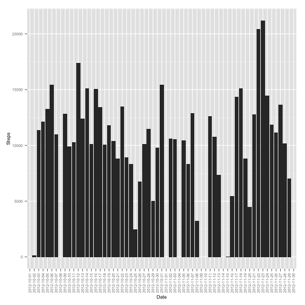
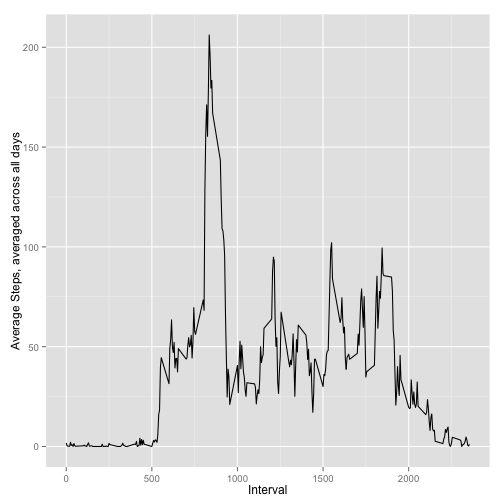
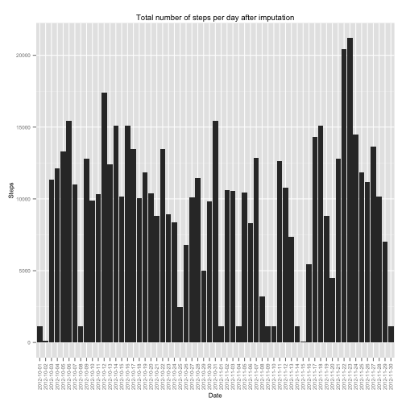
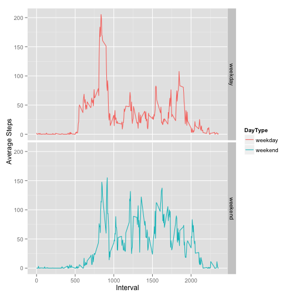

# Reproducible Research: Peer Assessment 1
### By: K Tsuruda
### Date: October 6, 2014


## Load and preprocess data

```r
library(RCurl)
```

```
## Loading required package: bitops
```

```r
library(devtools)
library(downloader)
```

```
## 
## Attaching package: 'downloader'
## 
## The following object is masked from 'package:devtools':
## 
##     source_url
```

```r

# create temp file for github zipped file.  download zip file from guthub
# unzip zip file and read in as table
temp <- tempfile()
download("https://github.com/tsurudak/RepData_PeerAssessment1/blob/master/activity.zip?raw=true", 
    temp)
dat <- read.csv(unz(temp, "activity.csv"), header = T)
unlink(temp)

# transform data to reflect total steps per day
dat2 <- as.data.frame(tapply(dat$steps, dat$date, sum))

# fix row data and column names
dat2$date <- rownames(dat2)
colnames(dat2) <- c("Steps", "Date")
```


## Mean total number of steps taken per day

```r

# histogram of steps taken each day
        library(ggplot2)

        ggplot(dat2, aes(x=Date, y=Steps)) + 
                geom_histogram(stat = "identity") + # graph steps data
                # rotate y-axis labels so they can be read
                theme(axis.text.x = element_text(angle = 90, vjust = 0.5, hjust=1),
                      text = element_text(size=8))
```

```
## Warning: Removed 8 rows containing missing values (position_stack).
```

 

```r
        
# mean steps per day
        mean(dat2$Steps, na.rm = T)
```

```
## [1] 10766
```

```r

# median steps per day
        median(dat2$Steps, na.rm = T)
```

```
## [1] 10765
```


## Average daily activity pattern

```r
# average all steps across 5 min interval (instead of days)
dat3 <- as.data.frame(tapply(dat$steps, dat$interval, mean, na.rm = T))

# fix row data and column names
dat3$interval <- rownames(dat3)
colnames(dat3) <- c("Steps", "Interval")
dat3$Interval <- as.numeric(dat3$Interval)

# plot time series of the 5-minute interval (x-axis) and the average number
# of steps taken, averaged across all days (y-axis)
ggplot(dat3, aes(x = Interval, y = Steps, group = 1)) + geom_line() + xlab("Interval") + 
    ylab("Average Steps, averaged across all days")
```

 

```r

# Which 5-minute interval, on average across all the days in the dataset,
# contains the maximum number of steps?
head(dat3[order(-dat3$Steps), ], 1)
```

```
##     Steps Interval
## 835 206.2      835
```


## Imputing missing values
There are a number of days/intervals where there are missing values (coded as NA). 
The presence of missing days may introduce bias into some calculations or 
summaries of the data.

First the total number of missing values in the dataset (i.e. the total number of rows 
with NAs) is calculated:

```r
colSums(is.na(dat))
```

```
##    steps     date interval 
##     2304        0        0
```


Missing values are filled then in with the median number of steps for the given 
5-minute interval:

```r
# Create a new dataset that is equal to the original dataset but with the
# missing data filled in using the median number of steps for the specified
# interval.

dat4 <- dat

lookup <- as.data.frame(tapply(dat4$steps, dat4$interval, median, na.rm = T))
lookup[is.na(lookup)] <- 0
lookup$date <- rownames(lookup)
colnames(lookup) <- c("AvgSteps", "Interval")
lookup$Interval <- as.integer(lookup$Interval)


for (i in 1:nrow(dat4)) {
    # print(i)
    if (is.na(dat4[i, c("steps")])) {
        for (j in 1:nrow(lookup)) if (dat4[i, c("interval")] == lookup[j, c("Interval")]) 
            dat4[i, c("steps")] <- lookup[j, c("AvgSteps")]
        # print(j)
    }
}
```


Histogram of the total number of steps taken each day.

```r
# transform data to reflect total steps per day
        dat5 <- as.data.frame(tapply(dat4$steps, dat$date, sum))

# fix row data and column names
        dat5$date <- rownames(dat5)
        colnames(dat5) <- c("Steps", "Date")

# histogram of steps taken each day
        ggplot(dat5, aes(x=Date, y=Steps)) + 
                geom_histogram(stat = "identity") + # graph steps data
                # rotate y-axis labels so they can be read
                ggtitle("Total number of steps per day after imputation") +
                theme(axis.text.x = element_text(angle = 90, vjust = 0.5, hjust=1),
                      text = element_text(size=8))
```

 


Mean and Median total number of steps taken per day:

```r
# mean steps per day
mean(dat5$Steps, na.rm = T)
```

```
## [1] 9504
```

```r

# median steps per day
median(dat5$Steps, na.rm = T)
```

```
## [1] 10395
```

The mean and median number of steps is lower than for the first part of the
assignment due to the number of imputed 0s. The mean was more effected than the
median, due to it's sensitivity to extreme values (i.e. 0's)

Imputing missing data increases the estimates of the total daily number of steps,
as can be seen by substracting the imputed estimates from the original estimates (
all are positive, indicating an increase in the daily number of steps)

```r
dat2[is.na(dat2)] <- 0
dat5$Steps - dat2$Steps
```

```
## 2012-10-01 2012-10-02 2012-10-03 2012-10-04 2012-10-05 2012-10-06 
##       1141          0          0          0          0          0 
## 2012-10-07 2012-10-08 2012-10-09 2012-10-10 2012-10-11 2012-10-12 
##          0       1141          0          0          0          0 
## 2012-10-13 2012-10-14 2012-10-15 2012-10-16 2012-10-17 2012-10-18 
##          0          0          0          0          0          0 
## 2012-10-19 2012-10-20 2012-10-21 2012-10-22 2012-10-23 2012-10-24 
##          0          0          0          0          0          0 
## 2012-10-25 2012-10-26 2012-10-27 2012-10-28 2012-10-29 2012-10-30 
##          0          0          0          0          0          0 
## 2012-10-31 2012-11-01 2012-11-02 2012-11-03 2012-11-04 2012-11-05 
##          0       1141          0          0       1141          0 
## 2012-11-06 2012-11-07 2012-11-08 2012-11-09 2012-11-10 2012-11-11 
##          0          0          0       1141       1141          0 
## 2012-11-12 2012-11-13 2012-11-14 2012-11-15 2012-11-16 2012-11-17 
##          0          0       1141          0          0          0 
## 2012-11-18 2012-11-19 2012-11-20 2012-11-21 2012-11-22 2012-11-23 
##          0          0          0          0          0          0 
## 2012-11-24 2012-11-25 2012-11-26 2012-11-27 2012-11-28 2012-11-29 
##          0          0          0          0          0          0 
## 2012-11-30 
##       1141
```


## Activity patterns between weekdays and weekends
This section aims to determine whether there are differences in activity 
patterns between weekdays and weekends.

```r
# Create a new factor variable with two levels: “weekday” and “weekend”,
# indicating whether a given date is a weekday or weekend day.
library(timeDate)
dat6 <- dat4
dat6$DayType <- ifelse(isWeekday(dat6$date), c("weekday"), c("weekend"))
```


Panel plot containing a time series plot of the 5-minute interval 
(x-axis) and the average number of steps taken,
averaged across all weekday days or weekend days (y-axis):

```r
# aggregate output
dat7 <- aggregate(dat6$steps, by = list(dat6$DayType, dat6$interval), FUN = mean)
colnames(dat7) <- c("DayType", "interval", "AvgSteps")

# plot time series of the 5-minute interval (x-axis) and the average number
# of steps taken, averaged across weekends/weekdays
ggplot(dat7, aes(x = interval, y = AvgSteps, colour = DayType)) + geom_line() + 
    facet_grid(DayType ~ .) + xlab("Interval") + ylab("Average Steps")
```

 


Based on the results of the panel plot, it does appear that there is a 
difference in activity patterns between weekdays and weekends.
